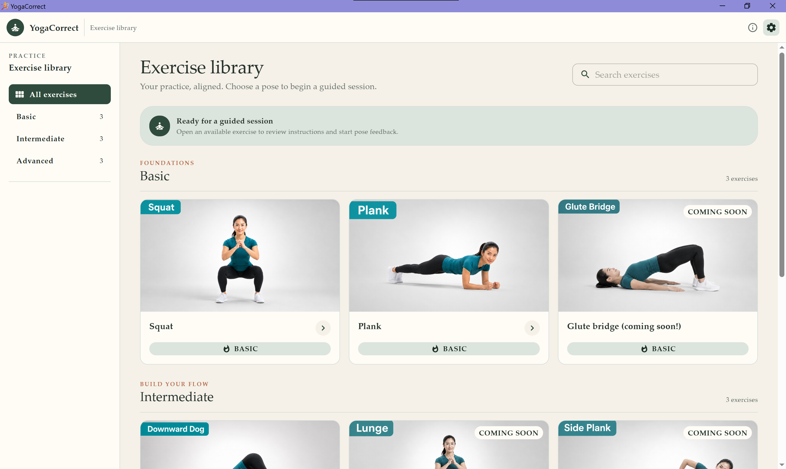
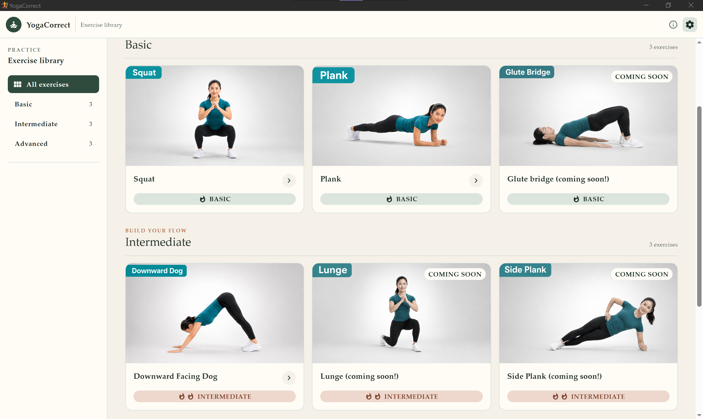
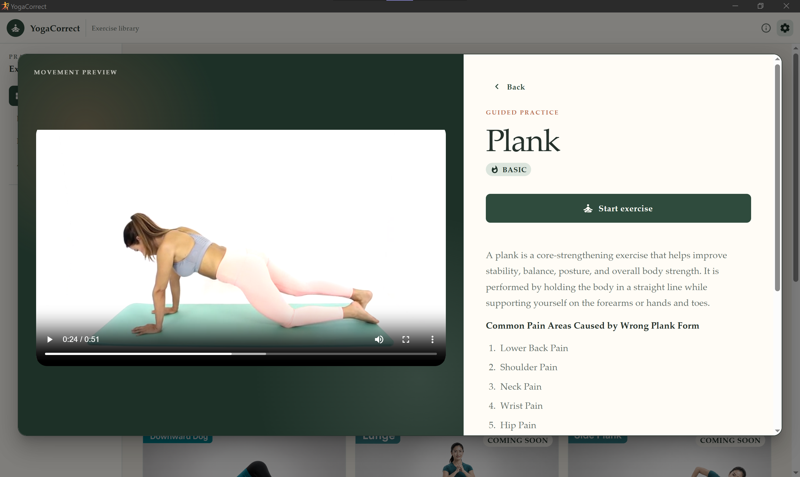

> Powered by [ElectronJS](https://www.electronjs.org/), [ONNX](https://onnx.ai/) and [Ultralytics YOLO11](https://platform.ultralytics.com/).

# ~Andalusite | AI-powered, Fully-offline, Real-time Yoga Form Correction

_Andalusite_ is a functional prototype for a desktop application that teaches you how to properly perform yoga exercises by providing instant feedback during the session.

Under the hood, it uses a combination of ONNX runtime and a Ultralytics YOLO11 model. Together, they track your posture during exercise through your webcam and provide realtime feedback so you can immediately adjust your posture.

> With this setup, _Andalusite_ functions even when you are completely disconnected from the internet. **No server, no third-party to steal and sell your data. Your likeness and facial features stay on your device.**

## ~Quick Start

Start by choosing an exercise from our catalogue.

## ~Briefing and Additional Details Before You Start

Once you have picked an exercise you would like to try, you will be presented with a short briefing on what to expect, as well as an example of how to properly perform the exercise.

> Even when it is your first time, you will not be going in blind!

